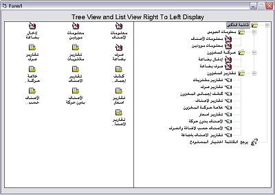



## Right to Left Treeview &amp; Listview controls

### Description

useful for Arbic / Urdu programmer to display Treeview and ListView controls from Right to Left instead Left to Right
 
### More Info
 

             |
---                |---
**Submitted On**   |2005-08-13 11:34:08
**By**             |[Sayed Aziz](https://github.com/Planet-Source-Code/PSCIndex/blob/master/ByAuthor/sayed-aziz.md)
**Level**          |Advanced
**User Rating**    |5.0 (10 globes from 2 users)
**Compatibility**  |VB 6\.0
**Category**       |[Windows API Call/ Explanation](https://github.com/Planet-Source-Code/PSCIndex/blob/master/ByCategory/windows-api-call-explanation__1-39.md)
**World**          |[Visual Basic](https://github.com/Planet-Source-Code/PSCIndex/blob/master/ByWorld/visual-basic.md)
**Archive File**   |[Right\_to\_L2160308192009\.zip](https://github.com/Planet-Source-Code/sayed-aziz-right-to-left-treeview-amp-listview-controls__1-72376/archive/master.zip)

